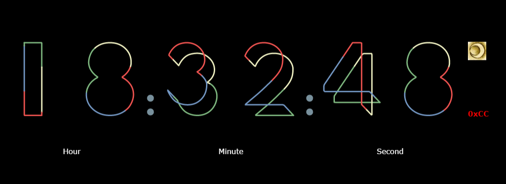

# google_io_clock
HTML5 digital clock ([Google I/O 2016 countdown style](https://events.google.com/io2016/))

# Modification
- Countdown --> Show current time
- Change colours, font...
- Delete intro animation and related code
- Add time separators, logo and name

# Preview

